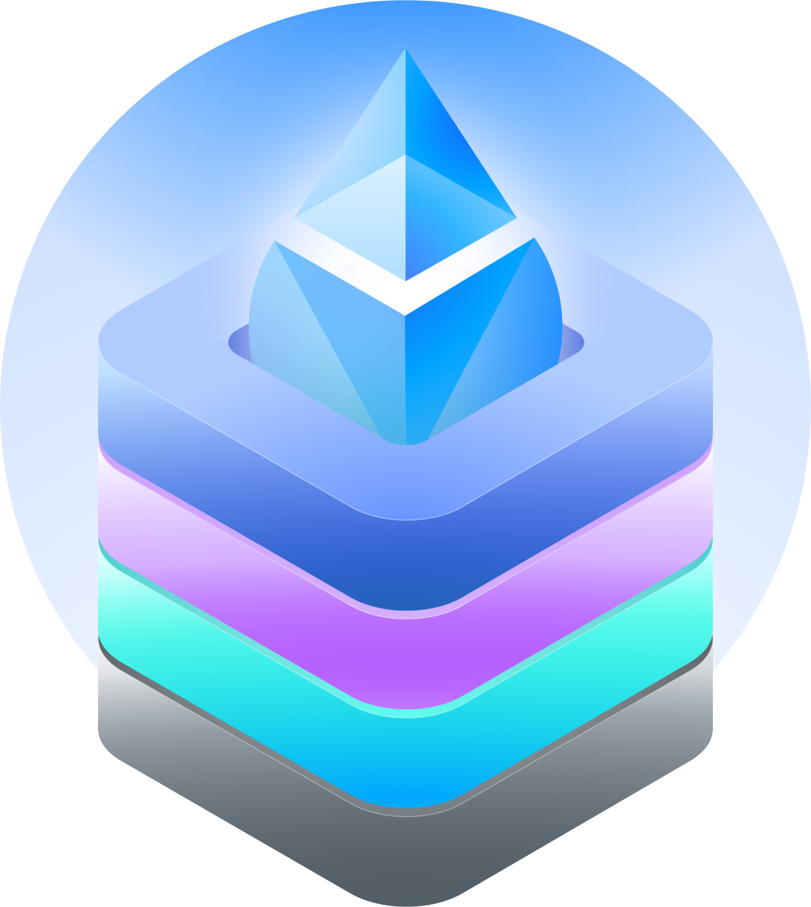

<p align="center">
  
</p>
<h1 align="center">Lido Staking Modules</h1>

## Intro

Smart contracts for the staking modules of the [Lido](https://lido.fi) protocol. Three modules ship from this repository and share a common code base:

- **Community Staking Module (CSM)** — permissionless module for community stakers. See more in [CSM docs](https://docs.lido.fi/staking-modules/csm/intro).
- **CSM 0x02** — CSM dedicated to validators with the `0x02` withdrawal credentials prefix.
- **Curated Module v2 (CMv2)** — next iteration of Lido's curated module. Reuses CSM components to introduce bond-based security, flexible operator classification, improved incentive alignment, and lower governance friction compared to the legacy curated module.

## Repository layout

- `src/` — Solidity sources
- `script/` — deploy and helper scripts
- `test/` — [Foundry](https://github.com/foundry-rs/foundry) tests
- `artifacts/` — per-chain deployment artifacts (`mainnet/`, `hoodi/`, plus `latest/` and `local/` working dirs)

## Getting Started

Prerequisites:

- [Foundry](https://book.getfoundry.sh/getting-started/installation) — version pinned in `.foundryref`.
- [Just](https://github.com/casey/just) 1.24.0 or later.
- [Yarn](https://classic.yarnpkg.com/) — 4.1 or later.
- [jq](https://jqlang.org/download/) 1.6 or later.
- OpenBSD-flavored `nc` (netcat) on some Linux distributions (e.g. Arch) for local fork recipes.

Bootstrap

```bash
just deps
```

Build and run unit tests

```bash
just build
just test-unit
```

Run `just --list` to see all available recipes.

## Utility contracts

The repository also ships a few utilities used for the modules:

- **`TwoPhaseFrameConfigUpdate`** — shifts the Oracle report window by reconfiguring the `HashConsensus` in a safe manner
- **`OneShotCurveSetup`** — atomically adds a new bond curve and applies its parameter overrides

## ICS Assessment

Python utilities for assessing Identified Community Stakers (ICS) eligibility across engagement, experience, and humanity categories live in [`ics_assessment/`](./ics_assessment/). Methodology and scoring are described in the [Research Forum post](https://research.lido.fi/t/community-staking-module/5917/141); see [`ics_assessment/README.md`](./ics_assessment/README.md) for usage.

## Contributing

See the [Contributing Guide](CONTRIBUTING.md) and repository conventions in `AGENTS.md`.
